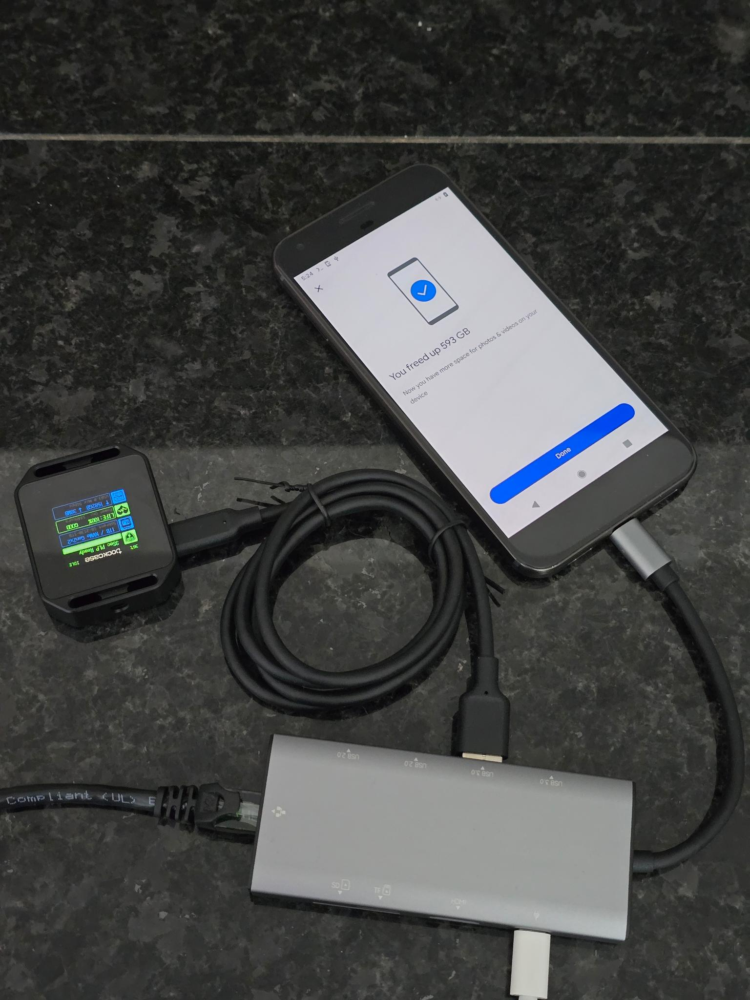

# pixel backup gang version 2.0

augment the OG pixel's internal storage with an external drive

> [!IMPORTANT]
> this repository now targets the pixel 1 xl (codename `marlin`) specifically.
> the scripts will refuse to run on other devices unless you explicitly
> override the safety check.

> [!WARNING]  
> this code is experimental and there is no guarantee that it works. rooting your phone or running any commands as root can be very dangerous. you have been warned.

anyway here is a demo image of an SSD mounted into the "internal storage" on my Pixel XL. the data is readable & writable in the Google Photos app.
> #### "You freed up 593 GB"
> 


## why? 🤔
from [google support](https://web.archive.org/web/20250725010242/https://support.google.com/photos/answer/6220791?co=GENIE.Platform%3DAndroid&oco=1#zippy=%2Cpixel-st-generation):
>
> > **Pixel (1st generation)**  
> >> You get unlimited storage in Original quality at no charge. You won’t be able to back up in Storage saver.

everyone needs storage. and everyone likes no charge. this sounds great! just back up your data through the device using the Google Photos app. but there's a catch - the Google Photos app pretends it can only see files located in the device's internal storage.

so everybody painstakingly copies their media into to their pixel's internal storage to get it backed up. some copy photos using FAT32 usb drives. some use FTP transfers. many use [syncthing](https://github.com/syncthing/syncthing) for automation. but i got fed up of transferring photos & videos over unreliable & slow network connections, just to drastically & unnecessarily shorten the flash memory's [limited lifetime](https://en.wikipedia.org/wiki/Flash_memory#Memory_wear). So i started looking into ways to get my unlimited storage without destroying my pixel in the process.

android is kinda just linux, right? so my first thought was to use [NFS](https://en.wikipedia.org/wiki/Network_File_System) to mount a remote filesystem. puny apps won't be able to tell the difference.


> #### "After all, why not? why shouldn't i mount a multi terabyte NAS into the DCIM folder on a 32 GB pixel?"
> 

alas, the Pixel's kernel wasn't compiled with NFS support (`cat /proc/filesystems`). We can actually add NFS support at runtime using a [loadable kernel module](https://source.android.com/docs/core/architecture/kernel/loadable-kernel-modules) - however i believe such a module needs to be signed by Google on the stock OS due to [Android Verified Boot](https://source.android.com/docs/security/features/verifiedboot/avb). i then looked into using [FUSE](https://en.wikipedia.org/wiki/Filesystem_in_Userspace) based solutions. There are userspace nfs clients like [nfs-ganesha](https://github.com/nfs-ganesha/nfs-ganesha) & local filesystem mounting solutions like [bindfs](https://github.com/mpartel/bindfs) (via [termux root-packages](https://github.com/termux/termux-packages/tree/817ccec622c510929e339285eb5400dbb5b2f4c7/root-packages/bindfs)) and [fuse-nfs](https://github.com/sahlberg/fuse-nfs.git) (complicated to compile for android so i built my own minimal version in Rust). this works and is especially good at sidestepping android 10's selinux policies. however i found FUSE's performance on the pixel to be incredibly slow. (note: i have not tried fbind but i don't think that works out of the box here without using FUSE)

so i spent some time figuring out a way to get files on external storage drives to show up to apps as if they are stored in the internal storage. this method is basically a set of hacks around the app sandbox (+ selinux policies in case of ext4) to **add an external storage drive into the device's internal storage**.

(if you don't care about using this automation and just want to see how it's done to do it yourself, take a look at [mount_ext4.sh](scripts/mount_ext4.sh))

### the good
* works with the stock kernel
* backs up external files larger than 4gb (stock OS only supports FAT32 for external drives)
* reduces wear on internal flash storage by up to 50% (see https://github.com/master-hax/pixel-backup/issues/30)
* can prevent the device from overheating - the external drive gets hot instead
* makes 32gb pixels viable for mass backup

### the bad
* phone needs to be rooted
* there's currently no way to auto-mount when the disk is connected

### the ugly
* there's no GUI, you need to execute shell scripts

## prerequisites
* a Google Pixel XL (marlin) on Android 10, rooted with [Magisk](https://github.com/topjohnwu/Magisk). the scripts now verify the
  codename/model before running to avoid accidental use on unsupported
  hardware.
* a USB storage drive formatted with an ext4 or FAT32 filesystem.

### pixel 1 xl limitations & how the scripts account for them
* **usb 2.0 otg throughput** – the first-gen pixel's usb-c port tops out at usb 2.0. expect ~30–35 MB/s maximum. the scripts print progress for each mount step so you can tell if slow copies are the phone or the drive.
* **otg power budget (~900 mA)** – many portable ssds need more current than the phone can supply. use a y-cable or powered hub; the mount helpers wait for stable devices and retry scans so short brown-outs don't leave half-mounted paths behind.
* **selinux lockdown** – android 10 on the pixel ships with strict policies. the ext4 flow temporarily toggles permissive mode (unless you opt out) and the vfat flow uses bind mounts so Google Photos can still traverse the files.
* **limited internal storage** – the tooling binds into `/storage/emulated/0` without copying data, keeping the 32 GB internal flash mostly free while still triggering Photos' unlimited backup path.
* **aging hardware** – the scripts include verbose logging & optional debug tracing so you can diagnose flaky usb connections or kernel quirks that crop up on well-used hardware.

## installation

installation is essentially just copying the scripts to the pixel 1 xl & making them executable. you can pull them straight onto the phone (Termux, adb shell, or the stock developer terminal) or stage them from a separate computer. you also probably want to disable [Google Play Protect](https://developers.google.com/android/play-protect) scanning in the Play Store menu.

### one-line install on the pixel (root shell required)

the fastest path on-device mirrors the legacy installer you linked. open a root shell (`su`) on the pixel and run:

```
curl -Ls https://raw.githubusercontent.com/master-hax/pixel-backup/main/install.sh | sh
```

the installer verifies that the phone is a pixel 1 xl, downloads the latest toolkit snapshot, installs it to `/data/local/tmp/pixel-backup`, and ensures every script is executable. pass `--install-magisk` to auto-stage the bundled magisk module immediately after the files are copied. customize where the scripts live by exporting `PIXEL_BACKUP_INSTALL_DIR=/path/you/prefer` before invoking the installer.

### install as a magisk module (pixel 1 xl convenience)
1. copy this repository onto the pixel (via `git clone`, `adb push`, or by
   downloading the archive in a browser) and open a terminal on the device.
1. run `su` to obtain root access, then execute `./scripts/install_magisk_module.sh`.
   the installer verifies that the phone reports itself as a pixel 1 xl
   (`marlin`), stages the magisk module, and copies the current versions of the
   scripts into `/data/adb/modules_update/pixel-backup`.
1. reboot the pixel when prompted. magisk completes the installation during the
   next boot and exposes the tooling at `/data/local/tmp/pixel-backup` as well as
   the global `pixel-backup-shell` wrapper on your `$PATH`.

this is the easiest way to keep the scripts available after a reboot. whenever you update the repository, rerun `install_magisk_module.sh` and reboot to redeploy the refreshed scripts through magisk. if you prefer a single command, run the one-line installer above with `--install-magisk` to copy the toolkit and stage the module in one go.

### install directly on the pixel 1 xl (manual, no script)
1. install [Termux](https://github.com/termux/termux-app) or enable the stock developer terminal so you can run commands locally.
1. launch the terminal app, run `su`, and grant root access in Magisk.
1. pick a writable directory such as `/data/local/tmp/pixel-backup` or `/data/data/com.termux/files/home/pixel-backup`:
   ```
   mkdir -p /data/local/tmp/pixel-backup
   cd /data/local/tmp/pixel-backup
   curl -L https://github.com/master-hax/pixel-backup/archive/refs/heads/main.tar.gz | tar -xz --strip-components=1
   chmod 0755 *.sh
   ```

you now have a fully functional copy of the tooling living on the pixel itself. updating in the future is just a matter of re-running the loop above (or re-running `install.sh`).

### from local repository via adb (preferred for development or large edits)
1. install the following software on your computer: `adb make shellcheck tar` (Linux or Windows Subsystem for Linux works; on macOS substitute `gmake` for `make`).
1. clone this repository (at the desired tag or commit).
1. run `make mobile-install` from the repository root. this installs the scripts to `/data/local/tmp` on the connected android device by default.
   * if your pixel has Termux installed, you can install the scripts to the Termux home directory with `make mobile-install DEVICE_INSTALL_DIRECTORY=/data/data/com.termux/files/home`
   * if you are running these steps on WSL, you should use the adb executable from windows (which has USB support) with `make mobile-install HOST_ADB_COMMAND=/mnt/c/Users/someone/AppData/Local/Android/Sdk/platform-tools/adb.exe`

this is the preferred installation method for development as it doesn't require an internet connection & any changes to the scripts in the local repo are immediately deployed to the pixel.

> [!NOTE]
> The directories `/data/local/tmp` & `/data/data/com.termux/files/home` are known to have less restrictive selinux policies, which allow files to be made executable. Installing the scripts to other directories may not work.

## usage

### configuration (optional)
create a file named `pixel-backup.conf` in the repository root or the
installation directory to override the default mount points. each option is a
shell variable assignment, for example:

```
PIXEL_BACKUP_BINDING_NAME=my_photos
PIXEL_BACKUP_DRIVE_MOUNT_DIR=/mnt/ssd
PIXEL_BACKUP_MEDIA_SCAN=0
```

available settings:

* `PIXEL_BACKUP_BINDING_NAME` – directory name that will appear in both the
  external drive and internal storage (defaults to `the_binding`)
* `PIXEL_BACKUP_DRIVE_MOUNT_DIR` – where the ext4 block device is mounted on the
  phone (defaults to `/mnt/pixel_backup_drive`)
* `PIXEL_BACKUP_INTERNAL_MOUNT_POINT` – override automatic Android-version
  detection for the internal storage mount
* `PIXEL_BACKUP_DISABLE_SELINUX` – set to `0` to skip the permissive SELinux
  toggle in `mount_ext4.sh`
* `PIXEL_BACKUP_MEDIA_SCAN` – set to `0` to skip the media scanner broadcast
* `PIXEL_BACKUP_DEBUG` – set to `1` to enable verbose debug logging and shell
  tracing for troubleshooting
* `PIXEL_BACKUP_SKIP_DEVICE_CHECK` – set to `1` only if you want to bypass the
  Pixel XL device guard (not recommended)

### setup
1. start a shell on the device & navigate to the installation directory
    * from the device
      * launch [Terminal](https://android.googlesource.com/platform/packages/apps/Terminal/), [Termux](https://github.com/termux/termux-app), [JuiceSSH](https://play.google.com/store/apps/details?id=com.sonelli.juicessh), or some other terminal app
      * run `su` then allow sudo access to your terminal app in Magisk
    * from a PC
      * run `adb shell`
      * run `su` then allow sudo access to the shell process in Magisk
1. run `cd` to navigate to the installation directory e.g. `cd ./pixel-backup` or `cd /data/data/com.termux/files/home/pixel-backup` or `cd /data/local/tmp/pixel-backup`
1. run `./start_global_shell.sh` (or the globally available `pixel-backup-shell`
   if you installed the magisk module) to enter the global mount namespace
    * the Magisk "force the global mount namespace" doesn't work - maybe it only works for magisk modules?

### mounting

#### ext4 drives (i prefer this because i have files larger than 4gb & ext4 is just [better than FAT32](https://en.wikipedia.org/wiki/Comparison_of_file_systems))
1. connect the ext4 formatted external drive to the pixel. you should get an os notification that says the drive is not supported. clear or ignore this notification.
   * this notification directs you to format the drive in FAT32 - don't do that
1. find the block device that you want to mount. it is usually found at `/dev/block/sdg1` but changes when devices are connected and disconnected e.g. it might show up as `/dev/block/sdh1` when reconnected. run `ls -alh /dev/block/` to see what is in there.
   * if you don't know the filesystem UUID, you can use `./show_devices.sh`. this is just a convenience script, you don't need to run this.
   * if you know the filesystem UUID, you can use `./find_device.sh`. this is just a convenience script, you don't need to run this.
1. run `./mount_ext4.sh <BLOCK_DEVICE>` e.g. `./mount_ext4.sh /dev/block/sdg1`
> [!CAUTION]
> `mount_ext4.sh` will attempt to set [selinux](https://en.wikipedia.org/wiki/Security-Enhanced_Linux) to permissive mode so that Google Photos and other apps can reach the mounted drive. set `PIXEL_BACKUP_DISABLE_SELINUX=0` in the configuration file if you want to opt out (mounting may fail on locked-down builds).

#### FAT32 drives (when you only have files < 4gb and/or don't want to disable selinux and/or are a Windows only user unwilling to install a tool like [Ext4Fsd](https://github.com/bobranten/Ext4Fsd.git) and/or are transferring directly from some kind of capture device)
1. connect the FAT32 formatted external drive to the pixel. it should be working normally as removable storage i.e. readable & writable by apps with permission.
1. find the name of folder that the drive is mounted to. it looks like `/mnt/media_rw/2IDK-11F4` - you can check the path displayed in any file explorer app.
1. run `./remount_vfat.sh <MOUNTED_FOLDER>` e.g. `./remount_vfat.sh /mnt/media_rw/2IDK-11F4`

**everything located under `/the_binding` on the external drive should now be visible by apps at `/the_binding` in the internal storage** (the directories are automatically created if they don't already exist). progress messages are printed throughout the mount so you can see what the script is doing.

> [!NOTE]  
> Google Photos will not instantly pick up the new media. It scans the filesystem to update their library when it wants to.
> However, we send a media scan broadcast when the drive is mounted ([ext4](scripts/mount_ext4.sh), [VFAT](scripts/remount_vfat.sh))
> this is reported to be reliable to get photos to do a scan, however you may need to force close then re-open Google Photos

### unmounting

1. make sure nothing important is reading from or writing to the drive
2. run `./unmount.sh`

**everything located under `/the_binding` in the internal storage should now be gone. you can disconnect the drive if you're sure all pending writes have been flushed.**

### forcing google photos to rescan (alternative refresh path)

if google photos still refuses to show the mounted media, run
`./force_media_scan.sh`. it replays every media database refresh trick we know
for the pixel 1 xl: the classic media scanner broadcast, a direct media
provider call, and a `content` cli invocation. all commands emit detailed echo
statements and debug logs (when enabled) so you can see whether each strategy
worked. this gives you an alternative way to kick photos into gear without
re-running the entire mount sequence.

## notes
* currently, the ext4 mounting script disables selinux security controls entirely, which is quite unsafe - do not have any kind of untrusted apps installed on your device while using this. selinux remains disabled until the next boot, or you can run the command `setenforce 1` to re-enable it earlier. don't forget that the software on the pixel is severely out of date and there are a lot of serious known vulnerabilities. try to keep device radios off (especially bluetooth and NFC) to reduce the attack surface.
* this scripts in this repo should not make any changes to a pixel that persist past a reboot (besides the scripts themselves existing wherever you saved them)
* my recommendation for regular usage is to find your drive's filesystem UUID using `./show_devices.sh` and store it. you can then use this UUID in a script to always re-mount that same drive without having to figure out what the block device path is at e.g. something like `./mount_ext4.sh $(./find_device.sh ./my_drive_id.txt)`
* list of shell utilities available per android version: https://android.googlesource.com/platform/system/core/+/refs/heads/main/shell_and_utilities/#android-10-api-level-29_quince-tart
* excellent reference: https://android.stackexchange.com/questions/214288/how-to-stop-apps-writing-to-android-folder-on-the-sd-card/257401
